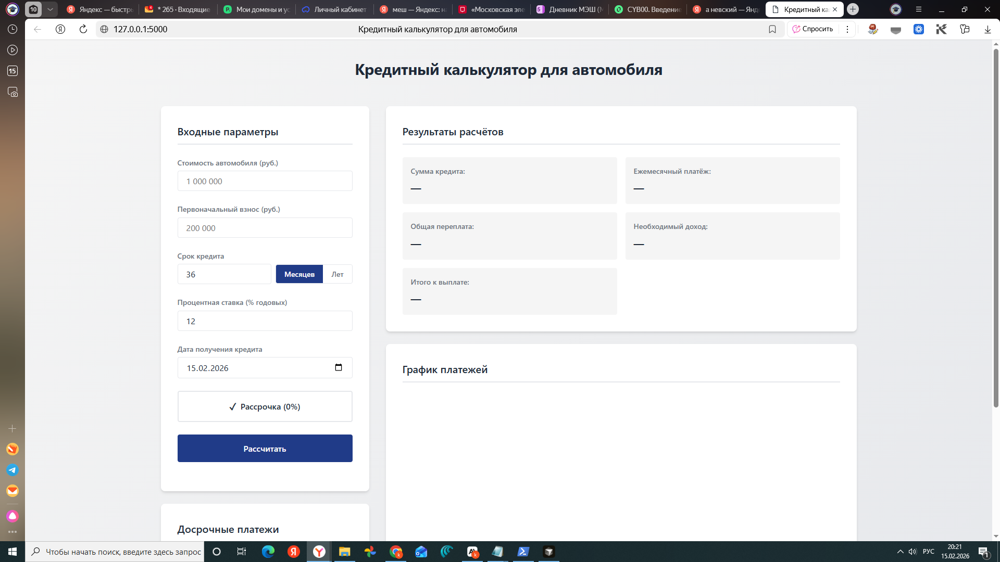
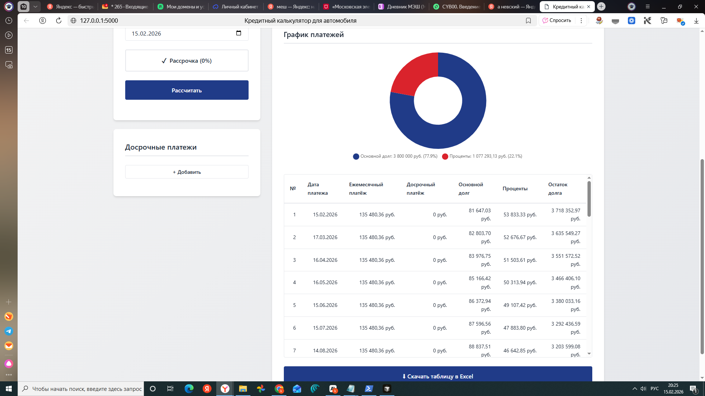
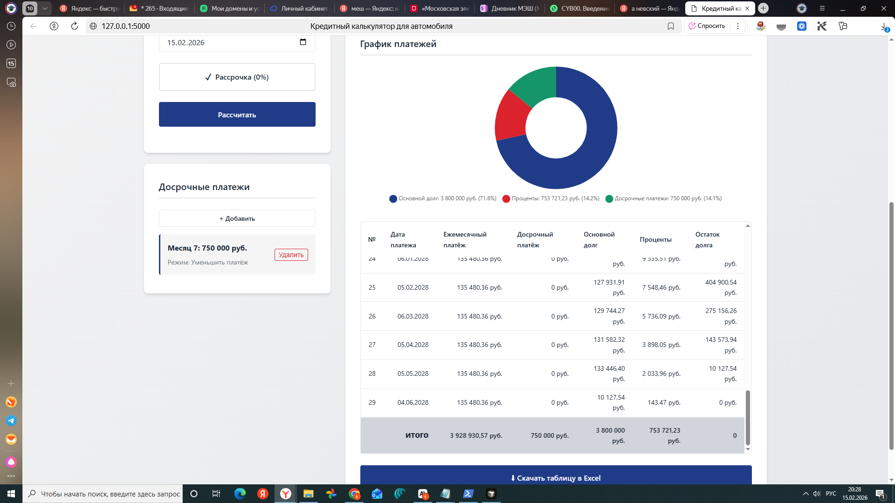

# Кредитный калькулятор для автомобиля

Полнофункциональное веб-приложение для расчёта автокредитов с визуализацией графика платежей, поддержкой досрочных платежей и возможностью экспорта в Excel.
## 📸 Скриншоты

### Интерфейс калькулятора


### Результаты расчёта


### График платежей


### Досрочные платежи


## Особенности

- ✅ Расчёт автокредита с аннуитетными платежами
- ✅ Режим рассрочки (0% годовых)
- ✅ Досрочные платежи с двумя режимами:
  - Уменьшение ежемесячного платежа
  - Уменьшение срока кредита
- ✅ Визуализация графика платежей (круговая диаграмма)
- ✅ Детальная таблица платежей
- ✅ Экспорт результатов в Excel (3 листа)
- ✅ Автоматическое форматирование чисел с пробелами между разрядами
- ✅ Современный дизайн в стиле неореализм

## Технологии

- **Backend:** Python 3.8+, Flask 2.3.0
- **Frontend:** HTML5, CSS3, JavaScript (ES6+)
- **Библиотеки:**
  - Chart.js для диаграмм
  - openpyxl для экспорта в Excel

## Установка и запуск

### 1. Установка зависимостей

```bash
pip install -r requirements.txt
```

### 2. Запуск приложения

```bash
python app.py
```

Приложение будет доступно по адресу: `http://localhost:5000`

## Структура проекта

```
auto-loan-calculator/
├── app.py                 # Основное приложение Flask
├── calculator.py          # Модуль расчётов кредита
├── requirements.txt       # Зависимости Python
├── README.md              # Документация
├── templates/
│   └── index.html         # HTML-шаблон
└── static/
    ├── css/
    │   └── style.css      # Стили в стиле неореализм
    └── js/
        ├── calculator.js  # Основная логика калькулятора
        ├── formatting.js  # Форматирование чисел
        └── charts.js      # Работа с диаграммами
```

## Использование

### Основные параметры

1. **Стоимость автомобиля** - полная стоимость автомобиля
2. **Первоначальный взнос** - сумма первоначального взноса (опционально)
3. **Срок кредита** - можно указать в месяцах или годах
4. **Процентная ставка** - годовая процентная ставка
5. **Дата получения кредита** - дата начала кредита

### Режим рассрочки

Нажмите кнопку "Рассрочка (0%)" для активации режима рассрочки. При этом поле процентной ставки скрывается, а ставка автоматически устанавливается на 0%.

### Досрочные платежи

1. Нажмите кнопку "+ Добавить" в блоке "Досрочные платежи"
2. Выберите месяц для досрочного платежа
3. Введите сумму платежа
4. Выберите режим:
   - **Уменьшить платёж** - уменьшается сумма ежемесячного платежа, срок остаётся прежним
   - **Уменьшить срок** - сокращается срок кредита, ежемесячный платёж может остаться прежним
5. Нажмите "Сохранить"

График платежей автоматически пересчитывается при добавлении или удалении досрочных платежей.

### Экспорт в Excel

После расчёта кредита нажмите кнопку "⬇ Скачать таблицу в Excel". Файл будет содержать три листа:

1. **Параметры кредита** - исходные параметры расчёта
2. **График платежей** - детальная таблица всех платежей
3. **Итоговая сводка** - сводные показатели

## Формулы расчёта

### Аннуитетный платёж

```
P = S * (r * (1 + r)^n) / ((1 + r)^n - 1)
```

где:
- P - ежемесячный платёж
- S - сумма кредита
- r - месячная процентная ставка (годовая ставка / 12 / 100)
- n - количество месяцев

### Досрочные платежи

- **Режим "Уменьшить платёж"**: досрочный платёж уменьшает основной долг, ежемесячный платёж остаётся прежним, срок может сократиться
- **Режим "Уменьшить срок"**: досрочный платёж уменьшает основной долг, график пересчитывается с новым сроком

## Лицензия

Проект создан в образовательных целях.
